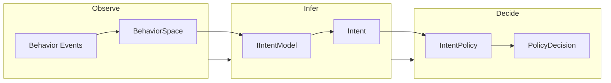
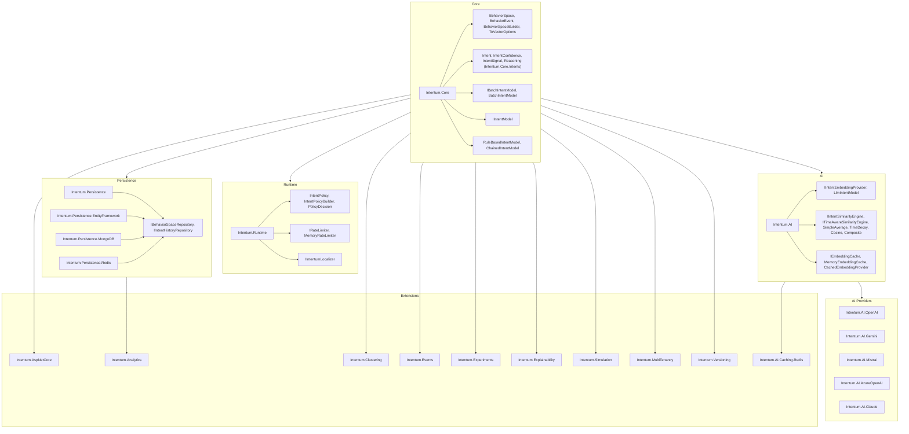
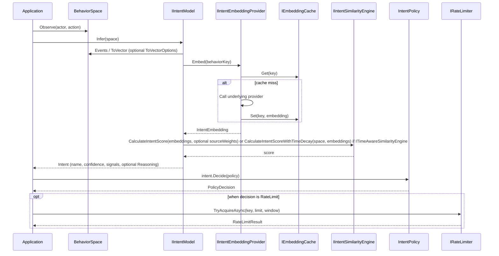
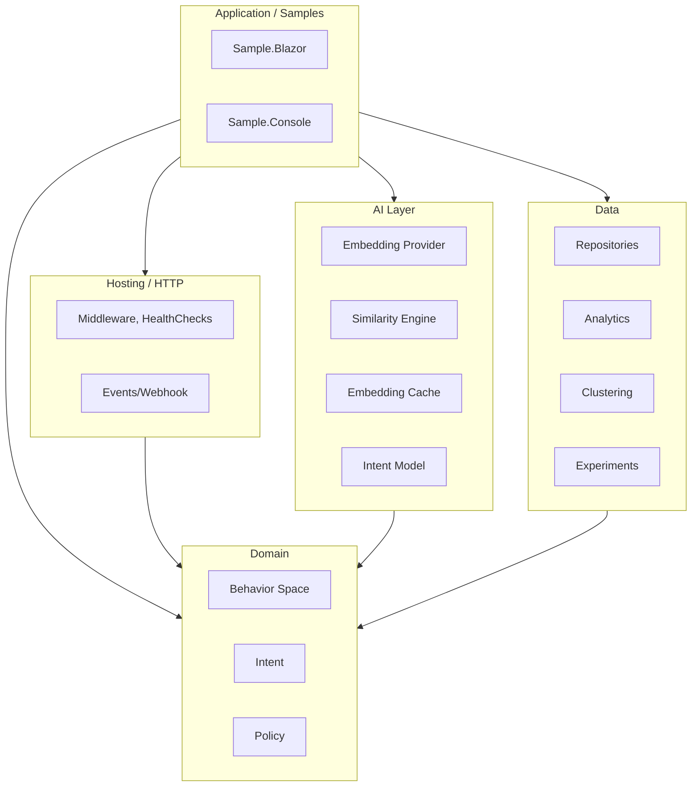
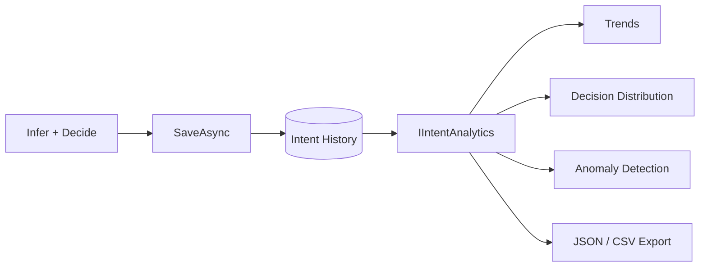
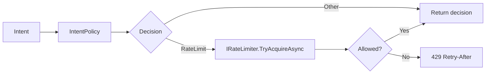
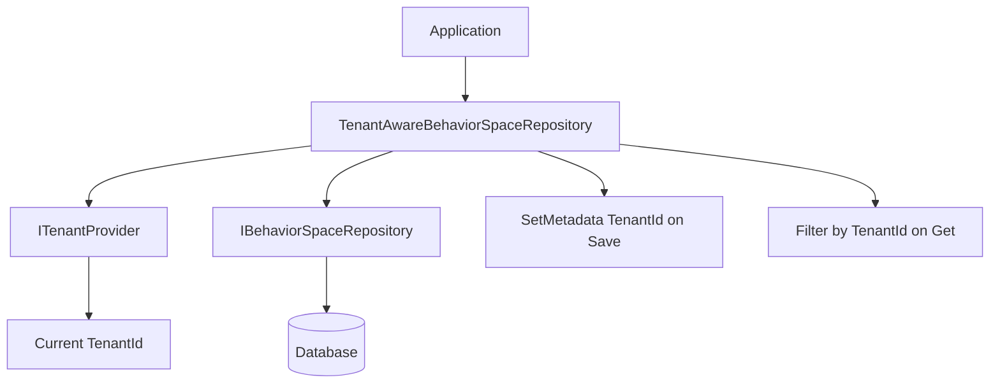

# Architecture (EN)

**Why you're reading this page** — This page explains Intentum’s architecture: which packages to use and why, and how the Observe → Infer → Decide flow maps to the code. Useful before setting up your first project or when choosing packages.

---

## Core flow: Observe → Infer → Decide

Intentum replaces scenario-based BDD with a three-step flow: record behavior, infer intent, then apply policy.

| Step | Responsibility |
|------|----------------|
| **Observe** | Record what happened: `space.Observe(actor, action)` or `BehaviorSpaceBuilder`. Events form a **BehaviorSpace**. Use **ToVector(options)** for optional normalization (Cap, L1, SoftCap). |
| **Infer** | **IIntentModel** (e.g. **LlmIntentModel**, **RuleBasedIntentModel**, or **ChainedIntentModel**) produces **Intent** (name, confidence, signals, optional **Reasoning**). LlmIntentModel uses embeddings + similarity engine; dimension counts as weights; **ITimeAwareSimilarityEngine** (e.g. TimeDecay) applied automatically when used. |
| **Decide** | **IntentPolicy** evaluates rules in order → **PolicyDecision** (Allow, Observe, Warn, Block, Escalate, RequireAuth, RateLimit). |

**Concrete example (e-commerce account takeover):**

- **Observe:** Alex, within one minute: 1) added 5 different credit cards, 2) placed orders to 10 different addresses, 3) changed the account password. The system records these events in a **BehaviorSpace**.
- **Infer:** **IIntentModel** infers intent from this behavior: Intent = AccountTakeover, confidence 92%. The system interprets this behavior as an "account takeover" intent.
- **Decide:** **IntentPolicy** rule: "above 85% confidence → Block + alert". Result: order is blocked, alert is sent to the security team.

---

## Package architecture

Packages are grouped by responsibility: core types, runtime (policy + rate limiting), AI (model + embeddings + caching), persistence, analytics, and optional extensions.

**All packages (summary):** Core, Runtime, AI, AI providers (OpenAI, Gemini, Mistral, Azure, Claude), Persistence (abstractions + EF, MongoDB, Redis), Analytics, AspNetCore, Clustering, Events, Experiments, Explainability, Simulation, MultiTenancy, Versioning, AI.Caching.Redis. Also Testing, Observability, Logging, CodeGen — see [API Reference](api.md) and [Advanced Features](advanced-features.md).

**Which package for which need?**

| What you need / What you want to do | Packages to get started | You can add later |
|-------------------------------------|--------------------------|-------------------|
| Intent detection only (rule-based or simple AI) | Intentum.Core | — |
| Decision rules (policy) and rate limiting | Intentum.Core + Intentum.Runtime | — |
| Intent inference with LLM (OpenAI, Gemini, etc.) | Intentum.Core + Intentum.AI + Intentum.AI.OpenAI (or other provider) | Intentum.AI.Caching.Redis (performance) |
| Store data in a database | Intentum.Core + Intentum.Persistence.EntityFramework (or MongoDB) | Intentum.Analytics |
| Use in a web app (ASP.NET Core) | Above + Intentum.AspNetCore | Intentum.MultiTenancy (multi-tenant) |

For detailed setup, see [Setup](setup.md).

---

## Inference pipeline (detail)

From a **BehaviorSpace** to a **PolicyDecision**, data flows through embedding, similarity, and policy evaluation.

---

## Layer view

A simplified view of how layers depend on each other (no package names in nodes to keep the diagram readable).

---

## Optional flows

### Persistence and analytics

Intent history is stored via **IIntentHistoryRepository**; **IIntentAnalytics** consumes it for trends, decision distribution, anomaly detection, and export.

### Rate limiting

When the policy returns **RateLimit**, the application checks **IRateLimiter** (e.g. **MemoryRateLimiter**) and can return 429 with Retry-After.

### Multi-tenancy

**TenantAwareBehaviorSpaceRepository** wraps **IBehaviorSpaceRepository** and **ITenantProvider**: it injects `TenantId` into metadata on save and filters by tenant on read.

---

## Next step

If you're done here → [Setup](setup.md) or [Scenarios](scenarios.md).

---

## See also

- [Setup](setup.md) — Repository structure and samples
- [API Reference](api.md) — Main types and contracts
- [Advanced Features](advanced-features.md) — Similarity engines (time decay, source weights), vector normalization, rule-based and chained models, caching, clustering, events, analytics
