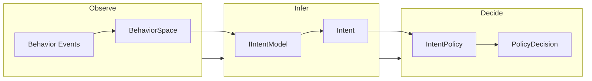
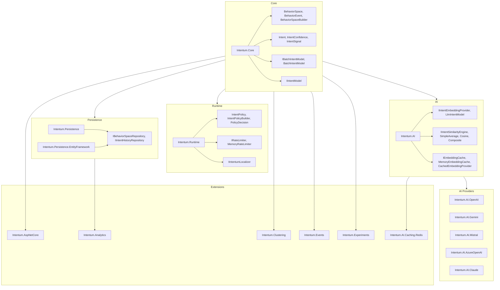
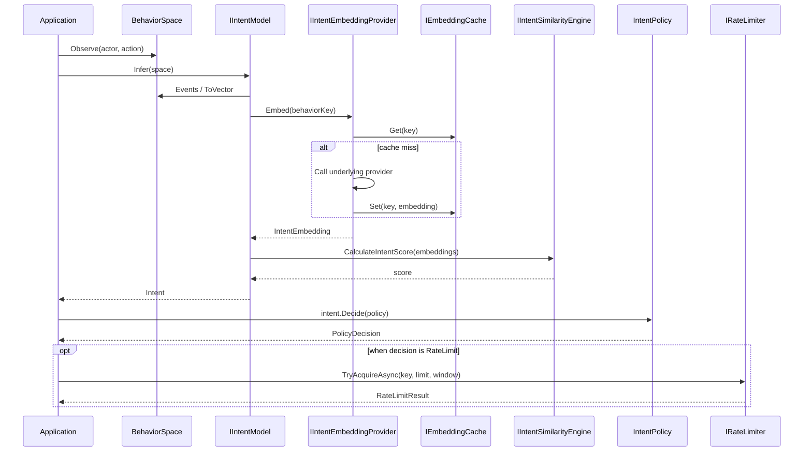
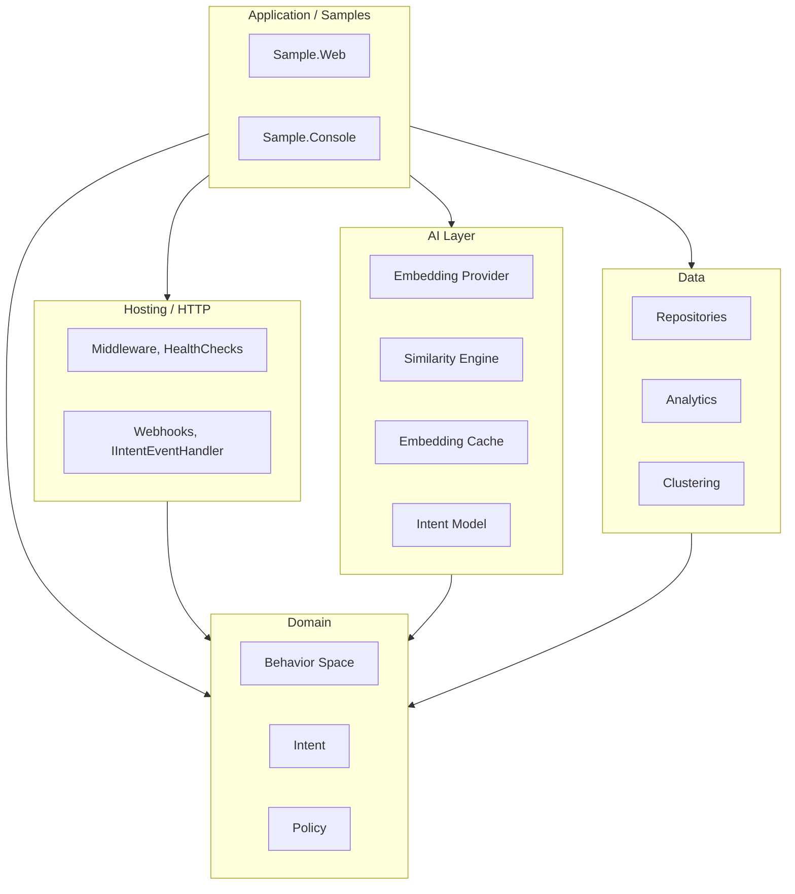
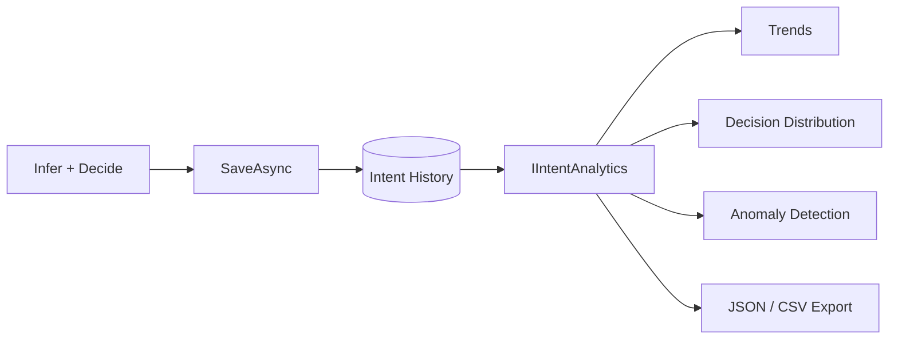
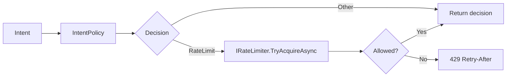
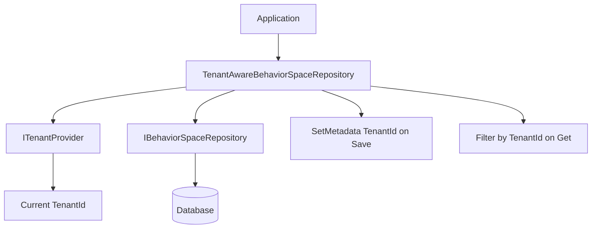

# Architecture (EN)

This page describes Intentum’s architecture: core flow, package layout, inference pipeline, and optional extensions. Diagrams use Mermaid.

---

## Core flow: Observe → Infer → Decide

Intentum replaces scenario-based BDD with a three-step flow: record behavior, infer intent, then apply policy.

| Step | Responsibility |
|------|----------------|
| **Observe** | Record what happened: `space.Observe(actor, action)` or `BehaviorSpaceBuilder`. Events form a **BehaviorSpace**. |
| **Infer** | **IIntentModel** (e.g. LlmIntentModel) uses embeddings + similarity engine → **Intent** (name, confidence, signals). |
| **Decide** | **IntentPolicy** evaluates rules in order → **PolicyDecision** (Allow, Observe, Warn, Block, Escalate, RequireAuth, RateLimit). |

---

## Package architecture

Packages are grouped by responsibility: core types, runtime (policy + rate limiting), AI (model + embeddings + caching), persistence, analytics, and optional extensions.

---

## Inference pipeline (detail)

From a **BehaviorSpace** to a **PolicyDecision**, data flows through embedding, similarity, and policy evaluation.

---

## Layer view

A simplified view of how layers depend on each other (no package names in nodes to keep the diagram readable).

---

## Optional flows

### Persistence and analytics

Intent history is stored via **IIntentHistoryRepository**; **IIntentAnalytics** consumes it for trends, decision distribution, anomaly detection, and export.

### Rate limiting

When the policy returns **RateLimit**, the application checks **IRateLimiter** (e.g. **MemoryRateLimiter**) and can return 429 with Retry-After.

### Multi-tenancy

**TenantAwareBehaviorSpaceRepository** wraps **IBehaviorSpaceRepository** and **ITenantProvider**: it injects `TenantId` into metadata on save and filters by tenant on read.

---

## See also

- [Setup](setup.md) — Repository structure and samples
- [API Reference](api.md) — Main types and contracts
- [Advanced Features](advanced-features.md) — Caching, clustering, events, analytics
