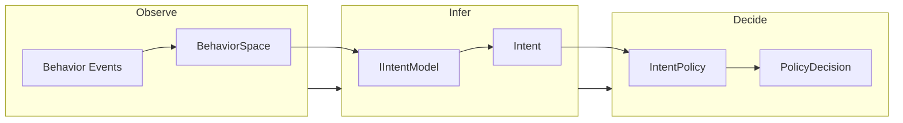
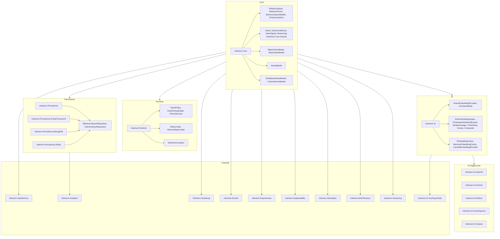
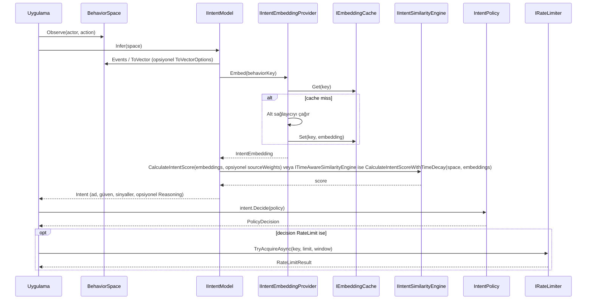
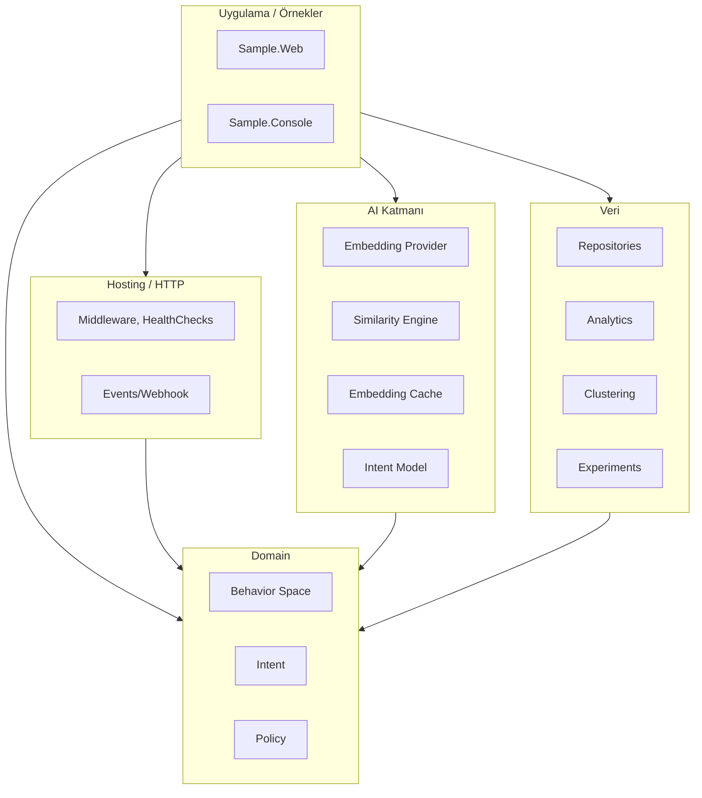
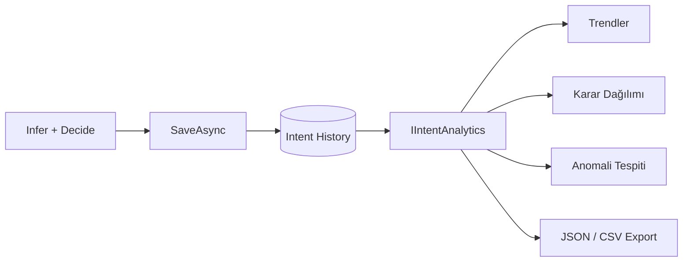
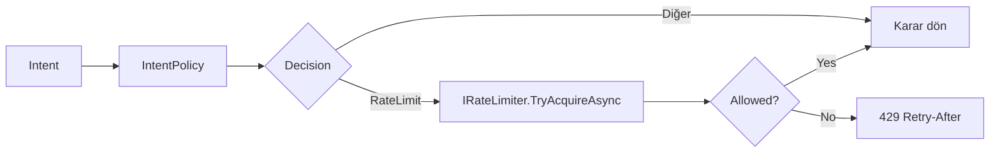
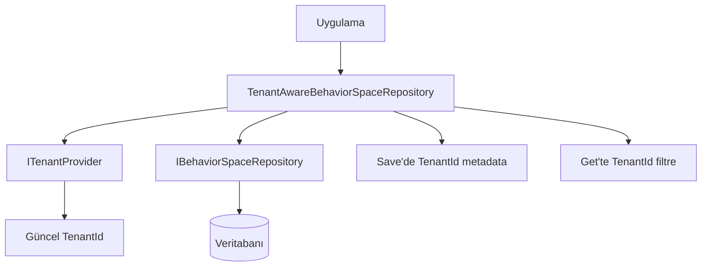

# Mimari (TR)

Bu sayfa Intentum mimarisini anlatır: temel akış, paket yapısı, inference pipeline ve opsiyonel uzantılar. Diyagramlar Mermaid kullanır.

---

## Temel akış: Observe → Infer → Decide

Intentum, senaryo tabanlı BDD yerine üç adımlı akış kullanır: davranışı kaydet, intent çıkar, policy uygula.

| Adım | Sorumluluk |
|------|-------------|
| **Observe** | Ne olduğunu kaydet: `space.Observe(actor, action)` veya `BehaviorSpaceBuilder`. Olaylar **BehaviorSpace** oluşturur. İsteğe bağlı normalizasyon için **ToVector(options)** (Cap, L1, SoftCap) kullan. |
| **Infer** | **IIntentModel** (örn. **LlmIntentModel**, **RuleBasedIntentModel** veya **ChainedIntentModel**) **Intent** (ad, güven, sinyaller, opsiyonel **Reasoning**) üretir. LlmIntentModel embedding + similarity engine kullanır; dimension count ağırlık olarak geçer; **ITimeAwareSimilarityEngine** (örn. TimeDecay) kullanıldığında otomatik uygulanır. |
| **Decide** | **IntentPolicy** kuralları sırayla değerlendirir → **PolicyDecision** (Allow, Observe, Warn, Block, Escalate, RequireAuth, RateLimit). |

---

## Paket mimarisi

Paketler sorumluluğa göre gruplanır: çekirdek tipler, runtime (policy + rate limiting), AI (model + embedding + cache), persistence, analytics ve opsiyonel uzantılar.

**Tüm paketler (özet):** Core, Runtime, AI, AI sağlayıcılar (OpenAI, Gemini, Mistral, Azure, Claude), Persistence (abstractions + EF, MongoDB, Redis), Analytics, AspNetCore, Clustering, Events, Experiments, Explainability, Simulation, MultiTenancy, Versioning, AI.Caching.Redis. Ayrıca Testing, Observability, Logging, CodeGen — bkz. [API Referansı](api.md) ve [Gelişmiş Özellikler](advanced-features.md).

---

## Inference pipeline (detay)

**BehaviorSpace**'ten **PolicyDecision**'a veri akışı: embedding, similarity ve policy değerlendirmesi.

---

## Katman görünümü

Katmanların birbirine bağımlılığının sadeleştirilmiş görünümü.

---

## Opsiyonel akışlar

### Persistence ve analytics

Intent geçmişi **IIntentHistoryRepository** ile saklanır; **IIntentAnalytics** trendler, karar dağılımı, anomali tespiti ve export için kullanır.

### Rate limiting

Policy **RateLimit** döndüğünde uygulama **IRateLimiter** (örn. **MemoryRateLimiter**) ile kontrol eder ve 429 + Retry-After dönebilir.

### Multi-tenancy

**TenantAwareBehaviorSpaceRepository**, **IBehaviorSpaceRepository** ve **ITenantProvider** ile sarar: save'de metadata'ya `TenantId` ekler, read'de tenant'a göre filtreler.

---

## Ayrıca bakınız

- [Kurulum](setup.md) — Repo yapısı ve örnekler
- [API Referansı](api.md) — Ana tipler ve sözleşmeler
- [Gelişmiş Özellikler](advanced-features.md) — Similarity engine'ler (time decay, source weights), vektör normalizasyonu, kural tabanlı ve zincirli modeller, caching, clustering, events, analytics
